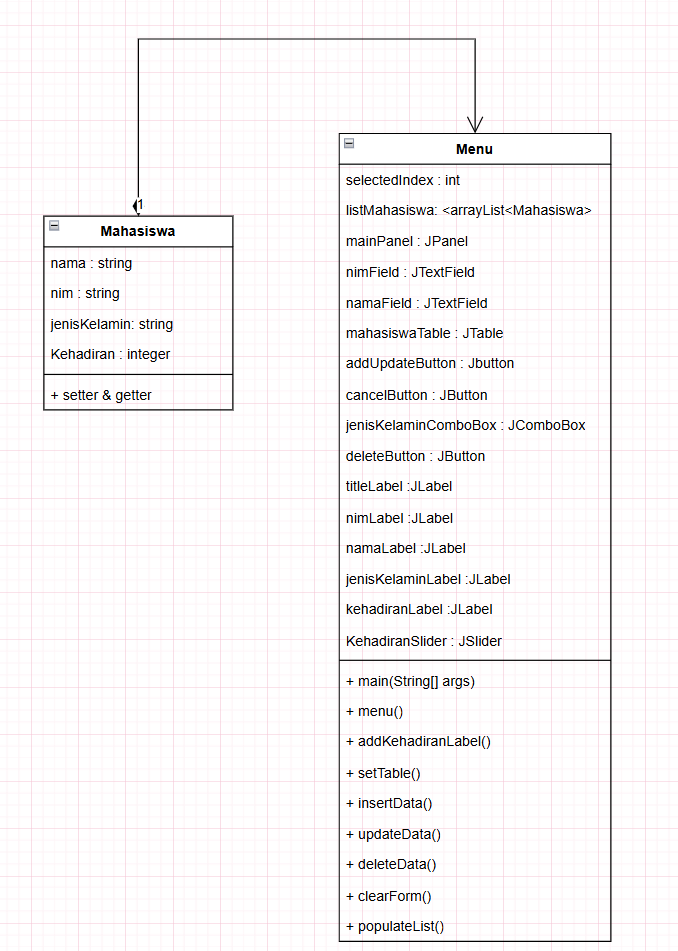

# TP4DPBO2025C1

## Janji
_Saya, **Hafsah Hamidah** dengan NIM **2311474**, mengerjakan **Tugas Praktikum 4** dalam mata kuliah **DPBO** dengan sebaik-baiknya demi keberkahan-Nya.  
Saya berjanji tidak melakukan kecurangan sebagaimana yang telah dispesifikasikan. **Aamiin.**_

## Deskripsi Program

Program ini adalah aplikasi berbasis **Java Swing** yang digunakan untuk mengelola data mahasiswa. Aplikasi ini menggunakan berbagai komponen GUI seperti **JTextField**, **JComboBox**, **JSlider**, **JButton**, dan **JTable** untuk menampilkan dan mengedit data mahasiswa. Program ini memungkinkan pengguna untuk melakukan **CRUD** (Create, Read, Update, Delete) pada data mahasiswa, serta menampilkan informasi terkait mahasiswa di dalam tabel.

Program ini dilengkapi dengan slider untuk mengukur **Kehadiran Mahasiswa** dan memungkinkan interaksi dengan pengguna melalui form untuk menambah, memperbarui, dan menghapus data mahasiswa.

### Fitur utama:
1. Menampilkan data mahasiswa dalam tabel.
2. Menambahkan mahasiswa baru ke dalam tabel.
3. Memperbarui data mahasiswa yang sudah ada.
4. Menghapus data mahasiswa dari tabel.
5. Menggunakan **JSlider** untuk mengukur kehadiran mahasiswa dan memperbarui label setiap kali nilai slider berubah.

## Desain Program

### 1. Struktur Kelas

- **Mahasiswa**: Kelas yang merepresentasikan data mahasiswa seperti **NIM**, **Nama**, **Jenis Kelamin**, dan **Kehadiran**.
- **Menu (GUI)**: Kelas utama untuk aplikasi dengan **GUI**. Ini adalah kelas yang mengatur layout dan interaksi antar komponen di jendela aplikasi. Di dalamnya terdapat form untuk memasukkan dan memperbarui data mahasiswa, serta tabel untuk menampilkan data yang ada.
  
  - **JTextField** untuk input **NIM** dan **Nama** mahasiswa.
  - **JComboBox** untuk memilih **Jenis Kelamin** mahasiswa.
  - **JSlider** untuk memasukkan data **Kehadiran** mahasiswa.
  - **JTable** untuk menampilkan data mahasiswa yang ada.
  - **JButton** untuk tombol **Add**, **Update**, **Delete**, dan **Cancel**.

### 2. Alur Program

**Main Program (Menu)**:
- Saat program dimulai, jendela aplikasi akan muncul dengan form kosong dan tabel mahasiswa.
- **Populate Data**: Data mahasiswa di-load ke dalam list menggunakan **populateList()**.
- **Add/Update**:
  - Pengguna dapat memasukkan data mahasiswa baru atau memperbarui data mahasiswa yang sudah ada.
  - Jika tombol **Add** ditekan, data akan dimasukkan ke dalam list dan tabel diperbarui.
  - Jika tombol **Update** ditekan, data yang dipilih pada tabel akan diperbarui dengan data yang dimasukkan dalam form.
  
**Tabel Mahasiswa**:
- Tabel menampilkan data mahasiswa yang tersimpan dalam list.
- Pengguna dapat memilih salah satu baris tabel untuk mengedit atau menghapus data mahasiswa tersebut.

**Delete**:
- Setelah memilih baris pada tabel, pengguna dapat menghapus data mahasiswa yang terpilih.
  
### 3. Komponen GUI
- **JTextField**: Digunakan untuk input **NIM** dan **Nama** mahasiswa.
- **JComboBox**: Untuk memilih **Jenis Kelamin** mahasiswa.
- **JSlider**: Untuk input **Kehadiran** mahasiswa, dengan nilai yang bisa dilihat di **JLabel**.
- **JButton**: Digunakan untuk tombol **Add**, **Update**, **Delete**, dan **Cancel**.
- **JTable**: Menampilkan data mahasiswa yang ada dalam list.

## Alur Kerja

### 1. Start Program
- Program dimulai dengan membuat objek dari kelas **Menu** yang menginisialisasi komponen-komponen GUI seperti **JTextField**, **JComboBox**, **JSlider**, **JButton**, dan **JTable**.
- Data mahasiswa yang ada dimasukkan ke dalam **listMahasiswa** yang disimpan di **ArrayList** dan kemudian ditampilkan dalam tabel.

### 2. Menambahkan Mahasiswa
- Pengguna mengisi **NIM**, **Nama**, dan memilih **Jenis Kelamin** serta **Kehadiran** menggunakan **JSlider**.
- Data mahasiswa baru akan ditambahkan ke dalam **listMahasiswa** dan tabel diperbarui dengan memanggil **setTable()**.

### 3. Memperbarui Mahasiswa
- Pengguna memilih baris dalam tabel dan mengedit data mahasiswa pada form.
- Setelah menekan **Update**, data mahasiswa yang dipilih pada tabel akan diperbarui.

### 4. Menghapus Mahasiswa
- Pengguna memilih baris dalam tabel yang ingin dihapus.
- Setelah menekan tombol **Delete**, mahasiswa yang dipilih akan dihapus dari **listMahasiswa** dan tabel diperbarui.

### 5. Reset Form
- Tombol **Cancel** akan menghapus data yang dimasukkan dan reset form kembali ke keadaan semula.

## Struktur Folder

```
src/
│
├── Menu.java          // Kelas utama yang menangani GUI dan logika CRUD
├── Mahasiswa.java     // Kelas model untuk data mahasiswa
```

### 6. Penggunaan JSlider
Pada form input **Kehadiran**, kita menggunakan **JSlider** untuk mengukur tingkat kehadiran mahasiswa, dengan nilai slider yang diubah antara 0-100%. Setiap kali slider digeser, **JLabel** **KehadiranLabel** akan diperbarui untuk menunjukkan nilai kehadiran yang terkini.

## Kesimpulan

Program ini memberikan contoh sederhana untuk menangani form input, tabel data, dan penggunaan slider dalam aplikasi Java Swing. Dengan komponen-komponen seperti **JTextField**, **JComboBox**, **JSlider**, dan **JTable**, kita dapat membuat antarmuka pengguna yang interaktif dan responsif.


## Dokumentasi 

<video controls src="Screenshoot/Recording 2025-03-23 104510.mp4" title="Dokumentasi"></video>